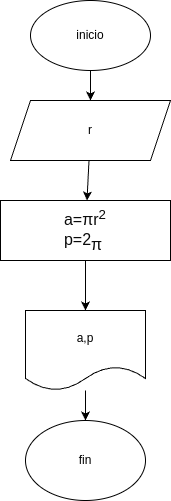

#programa 1:area_perimetro_circulo
programa en pithon para calcular el area y perimetro de un circulo dado el valor del radio

## Analisis

## vvariables de entrada
-r:radio del circulo

## procesamiento

-a:area del circulo
-p:perimetro del circulo

a=/pi*r²
p=2*/*r$

## Diseño

## construccion
-codigo implementado en el archivo

